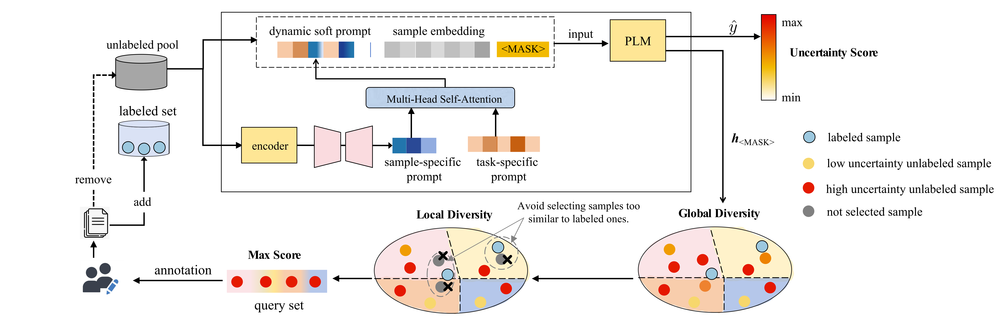

# DSPAL: Dynamic Soft Prompt for Few-shot Active Learning

>This repository contains the official implementation of the paper titled "DSPAL: Dynamic Soft Prompt for Few-shot Active Learning".

<p align="center">
  
</p>

## Datasets 
>We evaluate the AL algorithms in 6 Natural Language Processing (NLP)  datasets:
-  `TREC`, `IMDB`, `AGNEWS`, `DBPEDIA`, `Yelp-full` ,`Yahoo!Answers`

## Models
>We use  `RoBERTa-base` for the experiment, but the code can support any other model (e.g. from [HuggingFace](https://github.com/huggingface/transformers)) .

## Installation
>The experiments were performed on an NVIDIA  A100 GPU.
you should create a conda environment for the project:
```
conda env create -f DSPAL_environment.yml
```

## Training the Model

> To tune the model, you need to run the `run_AL.py` script. 
  
### Arguments

- `AL_method`: Different methods
  - Possible values: `hmask_cluster_calibration_entropy_local_div`, `hmask_cluster_local_div`, `hmask_cluster_entropy_local_div`, `hmask_cluster_calibration_entropy`,`hmask_cluster_calibration_entropy`,`hmask_cluster_entropy`,`entropy`,`random`


>`hmask_cluster_calibration_entropy_local_div` represents the DSPAL method, while the other methods are various ablation variants.

- `dataset_name`: Name of the task to be trained on.
    - Possible values: dbpedia', `imdb`, `agnews`, `yelp`, `trec`, `yahoo`, `dbpedia`
- `num_virtual_tokens` : Task-Specific Prompt size
- `instance_tokens`:Sample-Specific  Prompt size
- `multi_head`: The number of attention heads in the self-attention mechanism.
## Usage

The main script to run any AL experiment is `run_AL.py`. 

Example:
```
 python run_AL.py --dataset_name trec --multi_head 4 --instance_tokens 1 --num_virtual_tokens 4 
```
